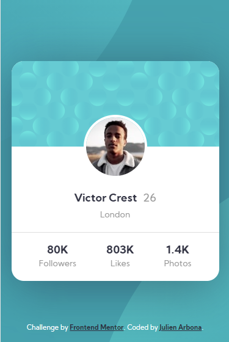

# Frontend Mentor - Profile card component

## Welcome! 👋

Thanks for checking out this front-end coding challenge.

[Frontend Mentor](https://www.frontendmentor.io) challenges help you improve your coding skills by building realistic projects.

**To do this challenge, you need a basic understanding of HTML and CSS.**

## The challenge

Your challenge is to build out this profile card component and get it looking as close to the design as possible.

You can use any tools you like to help you complete the challenge. So if you've got something you'd like to practice, feel free to give it a go.

Want some support on the challenge? [Join our Slack community](https://www.frontendmentor.io/slack) and ask questions in the **#help** channel.

## Submitting your solution

This is my solution for the challenge Stats-preview-card-component on Frontend Mentor

# Screenshots

- Desktop version

  

- Mobile version

  

## What I learned
- Background Image positioning
- Place vertically an image hover 2 divs

## Author
- Frontend Mentor [@Julien Arbona](https://www.frontendmentor.io/profile/ArbonaJulien)

## Got feedback for us?

We love receiving feedback! We're always looking to improve our challenges and our platform. So if you have anything you'd like to mention, please email hi[at]frontendmentor[dot]io.

This challenge is completely free. Please share it with anyone who will find it useful for practice.

**Have fun building!** 🚀
